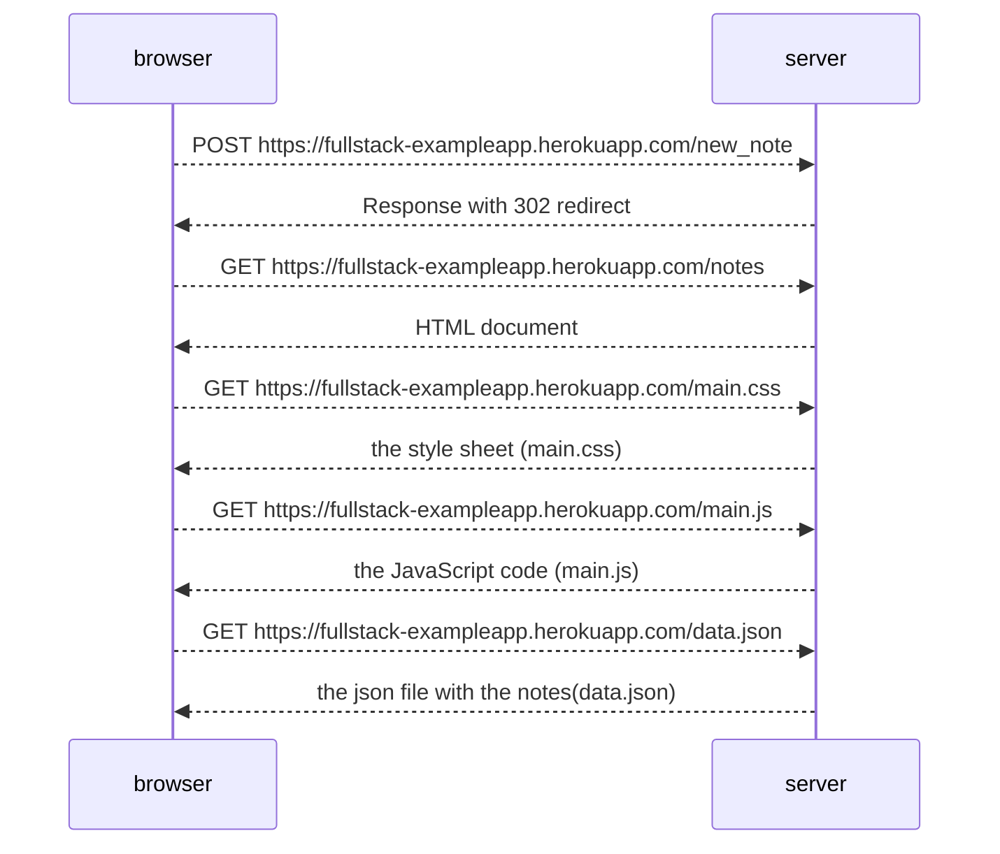

# New note diagram

```mermaid
sequenceDiagram
participant browser
participant server

browser-->>server:POST https://fullstack-exampleapp.herokuapp.com/new_note

server-->>browser:Response with 302 redirect

browser-->>server:GET https://fullstack-exampleapp.herokuapp.com/notes

server-->>browser: HTML document

browser-->>server: GET https://fullstack-exampleapp.herokuapp.com/main.css

server-->>browser:the style sheet (main.css)

browser-->>server:GET https://fullstack-exampleapp.herokuapp.com/main.js

server-->>browser: the JavaScript code (main.js)

browser-->>server: GET https://fullstack-exampleapp.herokuapp.com/data.json

server-->>browser: the json file with the notes(data.json)

```
