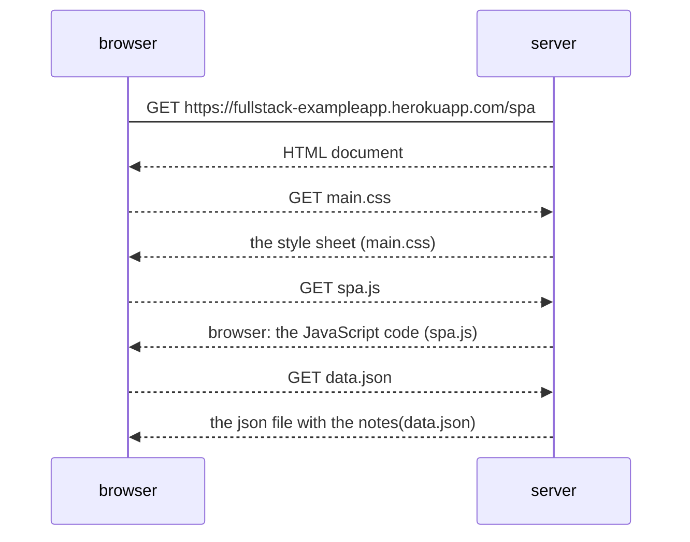

# Single page app diagram

```mermaid
sequenceDiagram
participant browser
participant server

browser->server: GET https://fullstack-exampleapp.herokuapp.com/spa

server-->>browser: HTML document

browser-->>server: GET main.css

server-->>browser: the style sheet (main.css)

browser-->>server: GET spa.js

server-->>browser: browser: the JavaScript code (spa.js)

browser-->>server: GET data.json

server-->>browser: the json file with the notes(data.json)

```
