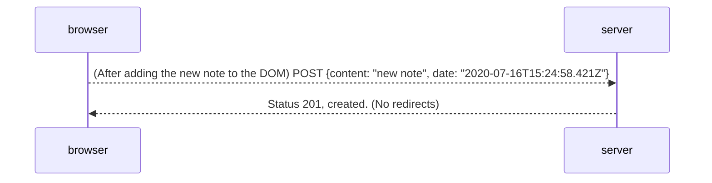

# New note in SPA

```mermaid
sequenceDiagram
participant browser
participant server

browser-->>server: (After adding the new note to the DOM) POST {content: "new note", date: "2020-07-16T15:24:58.421Z"}

server-->>browser: Status 201, created. (No redirects)

```
